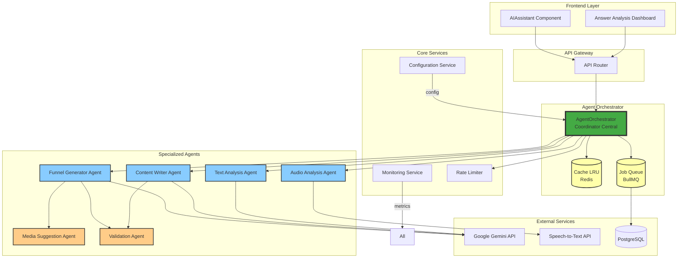
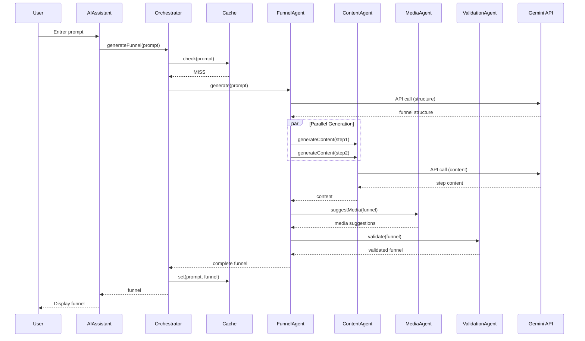
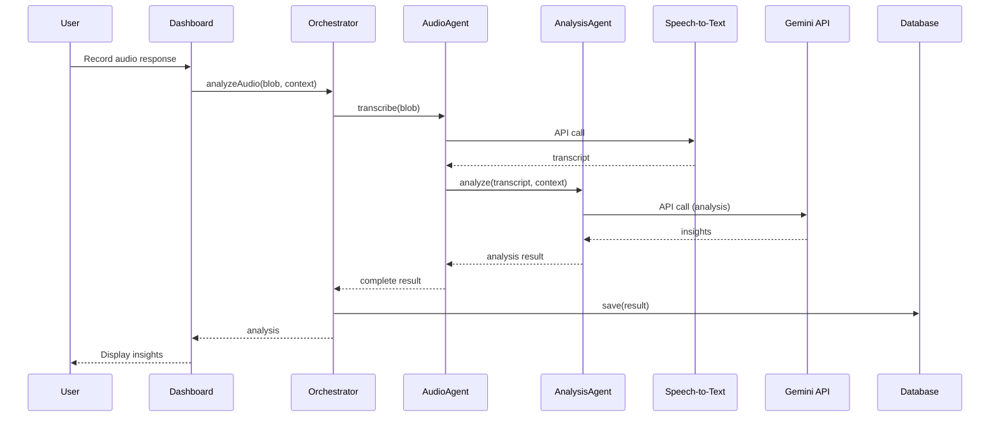
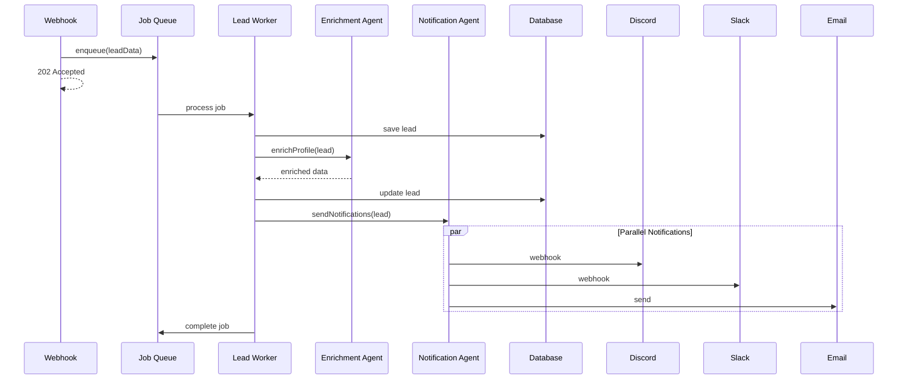

# Architecture des Agents IA - Face2Face

## Vue d'Ensemble

Ce document décrit l'architecture actuelle et proposée des agents IA du projet Face2Face.

---

## Architecture Actuelle (As-Is)

```mermaid
graph TB
    subgraph "Frontend"
        UI[AIAssistant.tsx]
        UI --> |prompt| AILib1[/lib/ai.ts]
        UI --> |analyze| AILib2[/src/lib/ai.ts]
    end

    subgraph "Agents IA Fragmentés"
        AILib1["/lib/ai.ts<br/>generateFunnelFromPrompt"]
        AILib2["/src/lib/ai.ts<br/>analyzeTextResponse<br/>transcribeAndAnalyzeAudio"]
    end

    subgraph "Backend"
        Webhook[lead.controller.ts<br/>Webhook Handler]
    end

    subgraph "Services Externes"
        Gemini[Google Gemini API]
    end

    AILib1 --> |API call| Gemini
    AILib2 --> |API call| Gemini
    Webhook --> |process| DB[(PostgreSQL)]

    style AILib1 fill:#f9f,stroke:#333,stroke-width:2px
    style AILib2 fill:#f9f,stroke:#333,stroke-width:2px
    style UI fill:#bbf,stroke:#333,stroke-width:2px
    style Webhook fill:#bfb,stroke:#333,stroke-width:2px
```

### Problèmes Identifiés

- 🔴 **Duplication:** Deux fichiers `ai.ts` séparés
- 🔴 **Pas de coordination:** Agents isolés sans orchestration
- 🔴 **Pas de cache:** Chaque requête appelle l'API
- 🔴 **Pas de queue:** Traitement synchrone des webhooks

---

## Architecture Cible (To-Be)



---

## Flux de Données

### 1. Génération de Funnel



### 2. Analyse de Réponse Audio



### 3. Traitement Asynchrone des Leads



---

## Structure des Fichiers Proposée

```
src/
└── agents/
    ├── core/
    │   ├── BaseAgent.ts              # Classe de base abstraite
    │   ├── AgentOrchestrator.ts      # Coordinateur principal
    │   ├── AgentConfig.ts            # Configuration centralisée
    │   └── types.ts                  # Types partagés
    │
    ├── funnel/
    │   ├── FunnelGeneratorAgent.ts   # Génération de structure
    │   ├── ContentWriterAgent.ts     # Génération de contenu
    │   ├── MediaSuggestionAgent.ts   # Suggestions de médias
    │   └── __tests__/
    │       └── FunnelGeneratorAgent.test.ts
    │
    ├── analysis/
    │   ├── TextAnalysisAgent.ts      # Analyse de texte
    │   ├── AudioAnalysisAgent.ts     # Transcription + analyse
    │   ├── SentimentAgent.ts         # Détection d'émotions
    │   └── __tests__/
    │       └── TextAnalysisAgent.test.ts
    │
    ├── validation/
    │   ├── ValidationAgent.ts        # Validation de cohérence
    │   ├── rules/
    │   │   ├── funnelRules.ts
    │   │   └── contentRules.ts
    │   └── __tests__/
    │
    └── utils/
        ├── cache/
        │   ├── PromptCache.ts        # Cache LRU
        │   └── CacheStrategy.ts
        ├── monitoring/
        │   ├── AgentMonitoring.ts    # Métriques
        │   └── Logger.ts             # Logs structurés
        ├── retry/
        │   ├── RetryStrategy.ts      # Logique de retry
        │   └── ExponentialBackoff.ts
        └── __tests__/
```

---

## Classes Principales

### BaseAgent (Abstract)

```typescript
// src/agents/core/BaseAgent.ts
export abstract class BaseAgent<TInput, TOutput> {
  protected config: AgentConfig;
  protected monitoring: AgentMonitoring;
  protected cache?: PromptCache;

  constructor(config: AgentConfig) {
    this.config = config;
    this.monitoring = new AgentMonitoring(this.name);
  }

  abstract get name(): string;
  abstract execute(input: TInput): Promise<TOutput>;

  async run(input: TInput): Promise<TOutput> {
    const startTime = Date.now();

    try {
      this.monitoring.trackStart(this.name);

      // Check cache
      if (this.cache) {
        const cached = await this.cache.get(input);
        if (cached) {
          this.monitoring.trackCacheHit(this.name);
          return cached;
        }
      }

      // Execute agent logic
      const result = await this.executeWithRetry(input);

      // Update cache
      if (this.cache) {
        await this.cache.set(input, result);
      }

      this.monitoring.trackSuccess(this.name, Date.now() - startTime);
      return result;

    } catch (error) {
      this.monitoring.trackError(this.name, error);
      throw error;
    }
  }

  private async executeWithRetry(input: TInput): Promise<TOutput> {
    const retry = new ExponentialBackoff({
      maxRetries: this.config.maxRetries,
      baseDelay: 1000
    });

    return retry.execute(() => this.execute(input));
  }
}
```

### AgentOrchestrator

```typescript
// src/agents/core/AgentOrchestrator.ts
export class AgentOrchestrator {
  private agents: Map<string, BaseAgent<any, any>>;
  private cache: PromptCache;
  private rateLimiter: RateLimiter;

  constructor() {
    this.agents = new Map();
    this.cache = new PromptCache();
    this.rateLimiter = new RateLimiter({ maxPerMinute: 100 });

    // Register agents
    this.registerAgent('funnel', new FunnelGeneratorAgent(config));
    this.registerAgent('content', new ContentWriterAgent(config));
    this.registerAgent('analysis', new TextAnalysisAgent(config));
    this.registerAgent('audio', new AudioAnalysisAgent(config));
  }

  private registerAgent(name: string, agent: BaseAgent<any, any>) {
    this.agents.set(name, agent);
  }

  async generateFunnel(prompt: string, settings?: GenerationSettings): Promise<Funnel> {
    await this.rateLimiter.checkLimit();

    const funnelAgent = this.agents.get('funnel') as FunnelGeneratorAgent;
    return funnelAgent.run({ prompt, settings });
  }

  async analyzeText(text: string, context: string): Promise<AnalysisResult> {
    await this.rateLimiter.checkLimit();

    const analysisAgent = this.agents.get('analysis') as TextAnalysisAgent;
    return analysisAgent.run({ text, context });
  }

  async analyzeAudio(blob: Blob, context: string): Promise<AudioAnalysisResult> {
    await this.rateLimiter.checkLimit();

    const audioAgent = this.agents.get('audio') as AudioAnalysisAgent;
    return audioAgent.run({ blob, context });
  }
}
```

### FunnelGeneratorAgent

```typescript
// src/agents/funnel/FunnelGeneratorAgent.ts
export class FunnelGeneratorAgent extends BaseAgent<FunnelInput, Funnel> {
  private contentAgent: ContentWriterAgent;
  private mediaAgent: MediaSuggestionAgent;
  private validationAgent: ValidationAgent;

  get name(): string {
    return 'FunnelGenerator';
  }

  async execute(input: FunnelInput): Promise<Funnel> {
    const { prompt, settings } = input;

    // 1. Generate structure
    const structure = await this.generateStructure(prompt, settings);

    // 2. Generate content for each step (parallel)
    const stepsWithContent = await Promise.all(
      structure.steps.map(step =>
        this.contentAgent.run({
          step,
          context: prompt,
          settings
        })
      )
    );

    // 3. Add media suggestions
    const withMedia = await this.mediaAgent.run({
      funnel: { ...structure, steps: stepsWithContent },
      settings
    });

    // 4. Validate
    const validated = await this.validationAgent.run(withMedia);

    return validated;
  }

  private async generateStructure(
    prompt: string,
    settings?: GenerationSettings
  ): Promise<FunnelStructure> {
    const systemPrompt = this.buildSystemPrompt(settings);
    const userPrompt = this.buildUserPrompt(prompt, settings);

    const response = await this.callGemini(systemPrompt, userPrompt);
    return this.parseStructure(response);
  }

  private buildSystemPrompt(settings?: GenerationSettings): string {
    return `You are an expert funnel creator...`;
  }

  private async callGemini(system: string, user: string): Promise<string> {
    const model = genAI.getGenerativeModel({
      model: 'gemini-1.5-pro',
      systemInstruction: system
    });

    const result = await model.generateContent(user);
    return result.response.text();
  }
}
```

---

## Configuration

### Agent Configuration

```typescript
// src/agents/core/AgentConfig.ts
export interface AgentConfig {
  gemini: {
    apiKey: string;
    model: string;
    timeout: number;
    maxRetries: number;
    temperature: number;
  };

  cache: {
    enabled: boolean;
    ttl: number;
    maxSize: number;
  };

  limits: {
    maxSteps: number;
    maxPromptLength: number;
    maxAudioSize: number;
  };

  monitoring: {
    enabled: boolean;
    logLevel: 'debug' | 'info' | 'warn' | 'error';
  };
}

export const defaultConfig: AgentConfig = {
  gemini: {
    apiKey: process.env.VITE_GEMINI_API_KEY || '',
    model: 'gemini-1.5-pro',
    timeout: 30000,
    maxRetries: 3,
    temperature: 0.7
  },

  cache: {
    enabled: true,
    ttl: 3600, // 1 hour
    maxSize: 1000
  },

  limits: {
    maxSteps: 15,
    maxPromptLength: 5000,
    maxAudioSize: 10 * 1024 * 1024 // 10MB
  },

  monitoring: {
    enabled: true,
    logLevel: 'info'
  }
};

export function validateConfig(config: AgentConfig): void {
  if (!config.gemini.apiKey) {
    throw new Error('VITE_GEMINI_API_KEY is required');
  }

  if (config.gemini.timeout < 1000 || config.gemini.timeout > 60000) {
    throw new Error('Timeout must be between 1s and 60s');
  }

  if (config.limits.maxSteps < 1 || config.limits.maxSteps > 20) {
    throw new Error('MaxSteps must be between 1 and 20');
  }
}
```

---

## Monitoring et Observabilité

### Métriques Clés

```typescript
// src/agents/utils/monitoring/AgentMonitoring.ts
export class AgentMonitoring {
  private metrics = {
    // Duration
    generationDuration: new Histogram({
      name: 'agent_generation_duration_ms',
      help: 'Agent generation duration in milliseconds',
      labelNames: ['agent', 'status']
    }),

    // Counts
    apiCalls: new Counter({
      name: 'agent_api_calls_total',
      help: 'Total API calls by agent',
      labelNames: ['agent', 'provider']
    }),

    errors: new Counter({
      name: 'agent_errors_total',
      help: 'Total errors by agent',
      labelNames: ['agent', 'error_type']
    }),

    cacheHits: new Counter({
      name: 'agent_cache_hits_total',
      help: 'Total cache hits',
      labelNames: ['agent']
    }),

    // Gauges
    activeRequests: new Gauge({
      name: 'agent_active_requests',
      help: 'Number of active requests',
      labelNames: ['agent']
    })
  };

  trackStart(agent: string): void {
    this.metrics.activeRequests.inc({ agent });
  }

  trackSuccess(agent: string, duration: number): void {
    this.metrics.generationDuration.observe({ agent, status: 'success' }, duration);
    this.metrics.activeRequests.dec({ agent });
  }

  trackError(agent: string, error: Error): void {
    this.metrics.errors.inc({ agent, error_type: error.name });
    this.metrics.activeRequests.dec({ agent });
  }

  trackCacheHit(agent: string): void {
    this.metrics.cacheHits.inc({ agent });
  }

  trackAPICall(agent: string, provider: string): void {
    this.metrics.apiCalls.inc({ agent, provider });
  }
}
```

### Dashboard Grafana

```yaml
# grafana/dashboards/agents.json
{
  "dashboard": {
    "title": "Face2Face AI Agents",
    "panels": [
      {
        "title": "Generation Duration (p95)",
        "targets": [
          {
            "expr": "histogram_quantile(0.95, agent_generation_duration_ms_bucket)"
          }
        ]
      },
      {
        "title": "API Calls Rate",
        "targets": [
          {
            "expr": "rate(agent_api_calls_total[5m])"
          }
        ]
      },
      {
        "title": "Error Rate",
        "targets": [
          {
            "expr": "rate(agent_errors_total[5m])"
          }
        ]
      },
      {
        "title": "Cache Hit Rate",
        "targets": [
          {
            "expr": "rate(agent_cache_hits_total[5m]) / rate(agent_api_calls_total[5m])"
          }
        ]
      }
    ]
  }
}
```

---

## Tests

### Exemple de Test Unitaire

```typescript
// src/agents/funnel/__tests__/FunnelGeneratorAgent.test.ts
describe('FunnelGeneratorAgent', () => {
  let agent: FunnelGeneratorAgent;
  let mockGemini: jest.Mock;

  beforeEach(() => {
    mockGemini = jest.fn();
    agent = new FunnelGeneratorAgent(testConfig);
  });

  it('should generate a valid funnel from prompt', async () => {
    const prompt = 'Create a funnel for selling online courses';
    const result = await agent.run({ prompt });

    expect(result).toBeDefined();
    expect(result.steps).toHaveLength(expect.any(Number));
    expect(result.title).toBeTruthy();
  });

  it('should respect max steps limit', async () => {
    const prompt = 'Very complex funnel';
    const settings = { maxSteps: 5 };

    const result = await agent.run({ prompt, settings });

    expect(result.steps.length).toBeLessThanOrEqual(5);
  });

  it('should retry on API failure', async () => {
    mockGemini
      .mockRejectedValueOnce(new Error('API Error'))
      .mockResolvedValueOnce({ text: () => 'Success' });

    const result = await agent.run({ prompt: 'Test' });

    expect(mockGemini).toHaveBeenCalledTimes(2);
    expect(result).toBeDefined();
  });

  it('should use cache for identical prompts', async () => {
    const prompt = 'Same prompt';

    const result1 = await agent.run({ prompt });
    const result2 = await agent.run({ prompt });

    expect(result1).toEqual(result2);
    expect(mockGemini).toHaveBeenCalledTimes(1); // Only once due to cache
  });
});
```

---

## Déploiement

### Infrastructure Required

```yaml
# docker-compose.yml additions
services:
  redis:
    image: redis:7-alpine
    ports:
      - "6379:6379"
    volumes:
      - redis-data:/data

  prometheus:
    image: prom/prometheus:latest
    ports:
      - "9090:9090"
    volumes:
      - ./prometheus.yml:/etc/prometheus/prometheus.yml

  grafana:
    image: grafana/grafana:latest
    ports:
      - "3001:3000"
    environment:
      - GF_SECURITY_ADMIN_PASSWORD=admin
    volumes:
      - grafana-data:/var/lib/grafana

volumes:
  redis-data:
  grafana-data:
```

---

## Roadmap

### Phase 1 - Q1 2025
- [x] Audit architecture
- [ ] Implémentation structure de base
- [ ] Migration agents existants
- [ ] Tests unitaires

### Phase 2 - Q2 2025
- [ ] Cache Redis
- [ ] Queue BullMQ
- [ ] Monitoring Prometheus
- [ ] Dashboard Grafana

### Phase 3 - Q3 2025
- [ ] Multi-agents collaboratifs
- [ ] Streaming support
- [ ] A/B testing prompts

### Phase 4 - Q4 2025
- [ ] Fine-tuning personnalisé
- [ ] Auto-scaling
- [ ] Analytics avancés

---

*Documentation maintenue par l'équipe Engineering - Dernière mise à jour: 2025-11-14*
